# 🛡️ Zabbix Monitoring Lab — Détection d'attaques & Intégration GLPI

   

Projet de monitoring réseau complet avec Zabbix 7.4 déployé sur AWS EC2 via Docker. Inclut la détection en temps réel d'attaques Brute Force SSH et RDP avec création automatique de tickets dans GLPI assignés au technicien responsable.

## 📋 Description

- Zabbix Server 7.4 déployé via Docker Compose sur AWS EC2
- 3 machines monitorées : Serveur Zabbix, Linux-Client, Windows-Client
- Détection Brute Force SSH sur le serveur Linux via logs auth.log
- Détection Brute Force RDP sur Windows via Event ID 4625
- Intégration GLPI : création automatique de tickets via API REST + Webhook
- Assignation automatique au technicien selon la sévérité
- Alertes Gmail configurées via SMTP

## 🏗️ Architecture

VM_SERVER_ZABBIX (172.31.16.197) : Zabbix Server + Docker
VM_GLPI (44.211.180.168) : GLPI + MariaDB
VM_CLIENT_ZABBIX (172.31.26.50) : Linux client monitored
VM_CLIENT_WINDOWS (172.31.21.206) : Windows client monitored

Flux : Linux-Client attaque SSH/RDP → Zabbix détecte → Webhook → GLPI crée ticket → Assigné à tech

## 📸 Screenshots

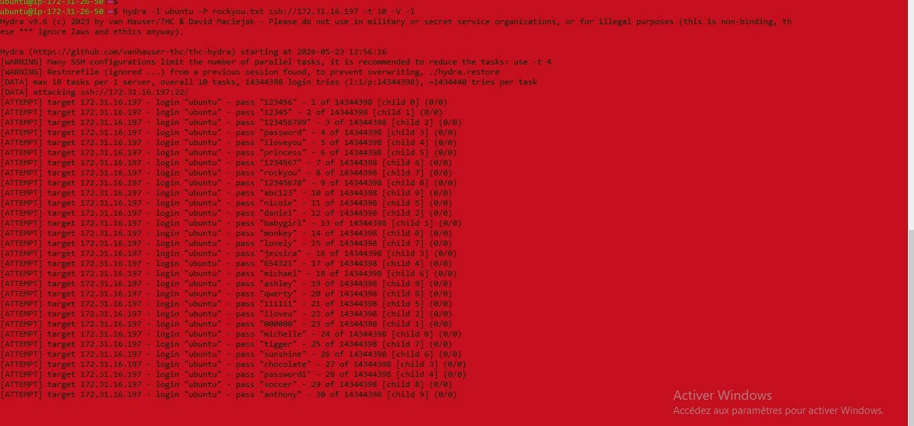

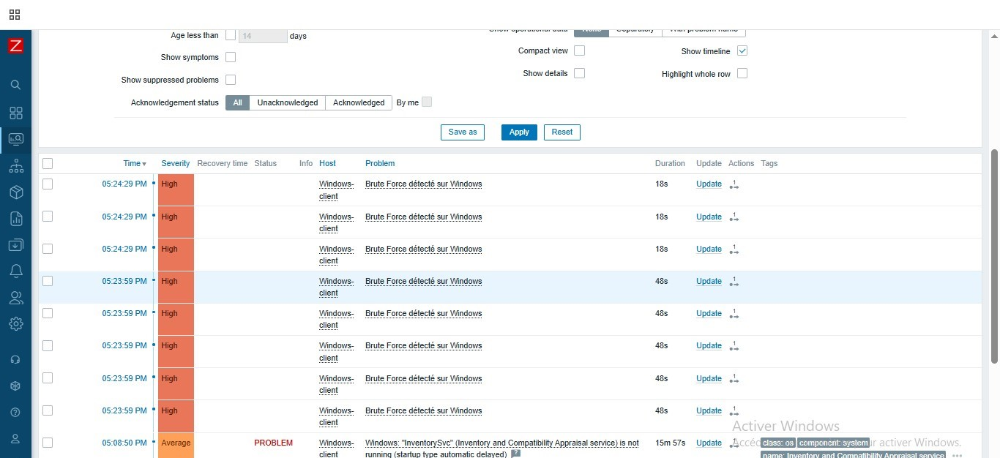

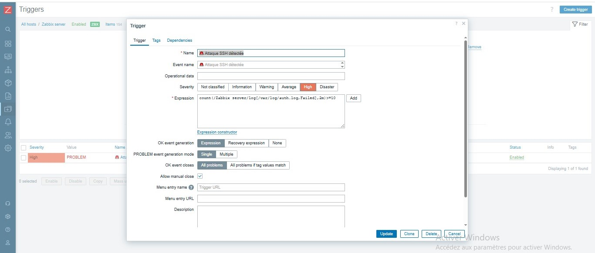
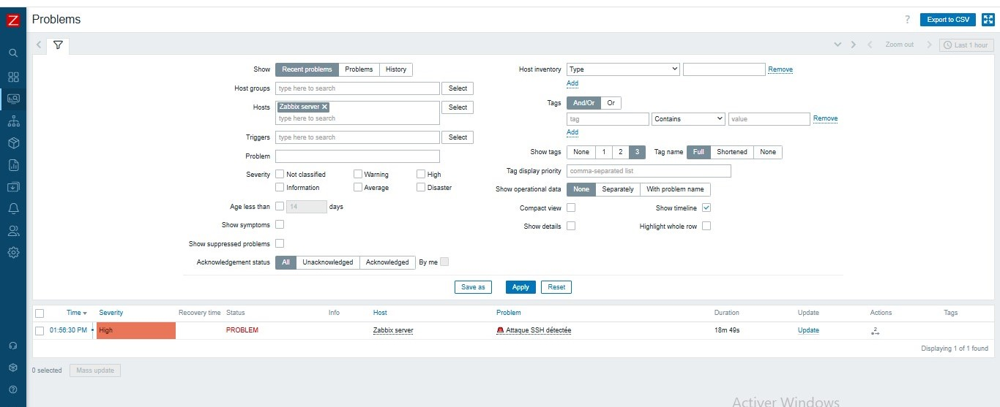
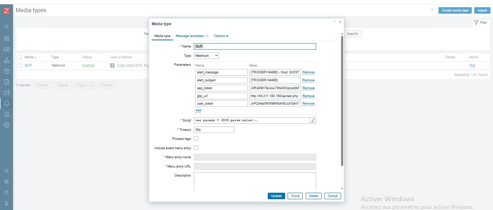
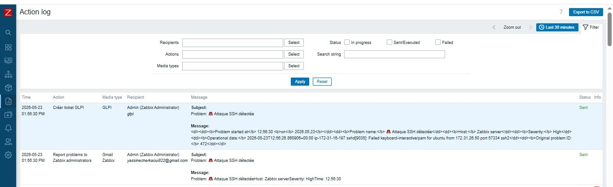
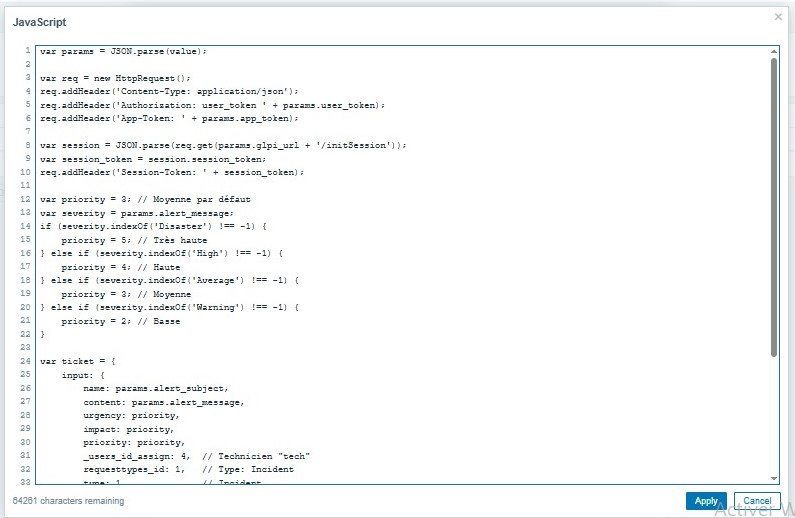
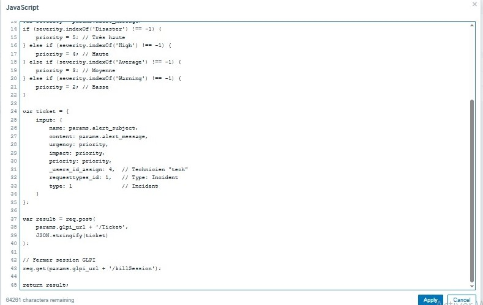
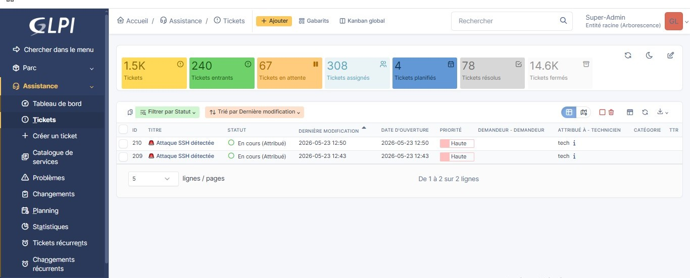
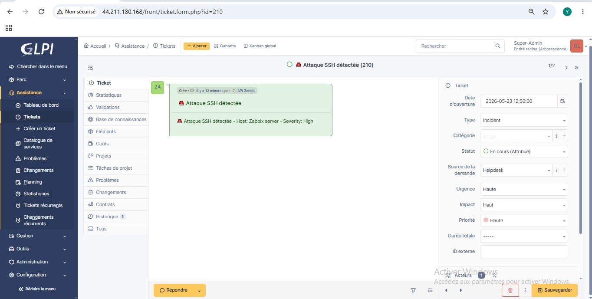
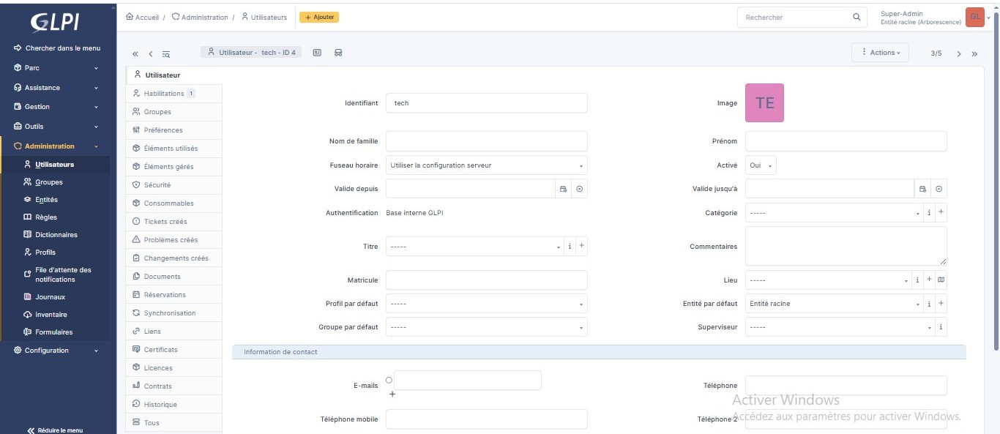
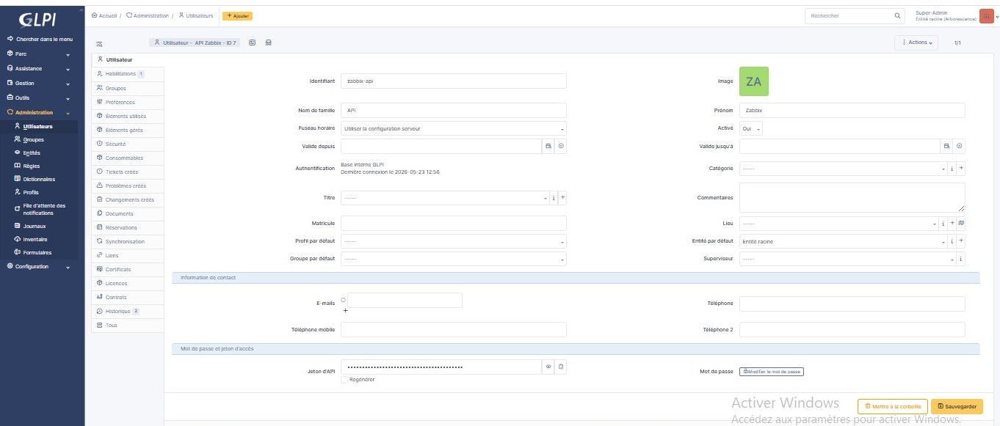

## ⚙️ Installation

### Prérequis
- AWS EC2 Ubuntu 24.04 (t3.medium)
- Docker + Docker Compose
- Zabbix Agent sur Linux et Windows
- Ports : 22, 80, 8080, 10050, 10051

### Étape 1 — Zabbix Server Docker
mkdir ~/zabbix && cd ~/zabbix
nano docker-compose.yml
docker compose up -d

### Étape 2 — Agent Linux
sudo nano /etc/zabbix/zabbix_agentd.conf
Server=127.0.0.1,172.17.0.1,172.18.0.2
ServerActive=127.0.0.1
Hostname=Zabbix server
sudo systemctl restart zabbix-agent

### Étape 3 — Agent Windows
Server=172.31.16.197
ServerActive=172.31.16.197
Hostname=Windows-client

### Étape 4 — AWS Security Group
Port 22 TCP SSH
Port 80 TCP GLPI Web
Port 8080 TCP Zabbix Web
Port 10050 TCP Zabbix Agent
Port 10051 TCP Zabbix Server

## 🔗 Intégration GLPI

### Flux
Zabbix détecte alerte >= High
→ Action Créer ticket GLPI
→ Webhook JavaScript appelle API REST GLPI
→ Ticket créé automatiquement
→ Assigné au technicien tech (ID=4)
→ Priorité dynamique selon sévérité

### Script Webhook JavaScript
var params = JSON.parse(value);
var req = new HttpRequest();
req.addHeader('Content-Type: application/json');
req.addHeader('Authorization: user_token ' + params.user_token);
req.addHeader('App-Token: ' + params.app_token);
var session = JSON.parse(req.get(params.glpi_url + '/initSession'));
req.addHeader('Session-Token: ' + session.session_token);
var priority = 3;
if (params.alert_message.indexOf('Disaster') !== -1) { priority = 5; }
else if (params.alert_message.indexOf('High') !== -1) { priority = 4; }
var ticket = { input: { name: params.alert_subject, content: params.alert_message, urgency: priority, impact: priority, priority: priority, _users_id_assign: 4, type: 1 }};
var result = req.post(params.glpi_url + '/Ticket', JSON.stringify(ticket));
req.get(params.glpi_url + '/killSession');
return result;

## 🔴 Scénarios d'attaque

### SSH Brute Force
hydra -l ubuntu -P ~/rockyou.txt ssh://172.31.16.197 -t 10 -V -I
Trigger : count(/Zabbix server/log[/var/log/auth.log,Failed],2m)>=10
Severity : High — Mode : Single

### RDP Brute Force
hydra -l Administrator -P ~/rockyou.txt rdp://172.31.21.206 -V -f -t 1 -W 3
Trigger : count(/Windows-client/eventlog[Security,,,,4625],5m)>=3
Severity : High — Mode : Multiple

## 📧 Gmail
SMTP server : smtp.gmail.com
SMTP port : 587
Connection : STARTTLS

## ✅ Résultat Final

Zabbix Server Docker : Opérationnel
Zabbix Web Interface : Port 8080
Agent Linux-Client : ZBX Vert
Agent Windows-Client : ZBX Vert
Agent Zabbix Server : ZBX Vert
Détection Brute Force SSH : Alerte High
Détection Brute Force RDP : Alerte High
Notification Gmail : Configuré
API GLPI activée : REST + Token
Webhook GLPI : Script JS
Ticket automatique GLPI : 1 ticket par attaque
Assignation technicien : tech (ID=4)
Priorité dynamique : Haute pour High
Filtre sévérité >= High : Configuré

## 🧠 Problèmes rencontrés

ZBX rouge → Ajouter 172.18.0.2 dans Server= de l'agent
Item eventlog Not supported → Changer en Zabbix agent active
Port 10051 bloqué → Ouvrir dans Security Group AWS
IPs Docker changent → Fixer IPs dans docker-compose.yml
Token API GLPI NULL → Générer via interface GLPI uniquement
ERROR_NOT_ALLOWED_IP → Créer client API avec plage 0.0.0.0/0
ERROR_GLPI_LOGIN_USER_TOKEN → Utiliser token généré par interface GLPI
Doublons tickets → Mode Single + séparer Gmail et GLPI
Variables TRIGGER.NAME non résolues → Utiliser alert_subject et alert_message

## 🔧 Commandes utiles

docker ps
docker logs zabbix-zabbix-server-1 --tail 50
sudo systemctl status zabbix-agent
sudo tail -f /var/log/auth.log
curl -X GET http://GLPI_IP/apirest.php/initSession -H 'Authorization: user_token TOKEN' -H 'App-Token: APP_TOKEN'
docker exec -it glpi-db mariadb -u root -pglpi_root glpidb -e "UPDATE glpi_tickets SET status=6 WHERE status!=6;"
cd ~/zabbix && docker compose down && docker compose up -d

## 📁 Structure

zabbix-monitoring-lab/
├── README.md
├── docker-compose.yml
├── zabbix_agentd.conf
├── zabbix/
└── screenshots/ (17 images)

Projet réalisé avec Zabbix 7.4.10 + GLPI 10.x sur AWS EC2 Ubuntu 24.04 — Mai 2026
