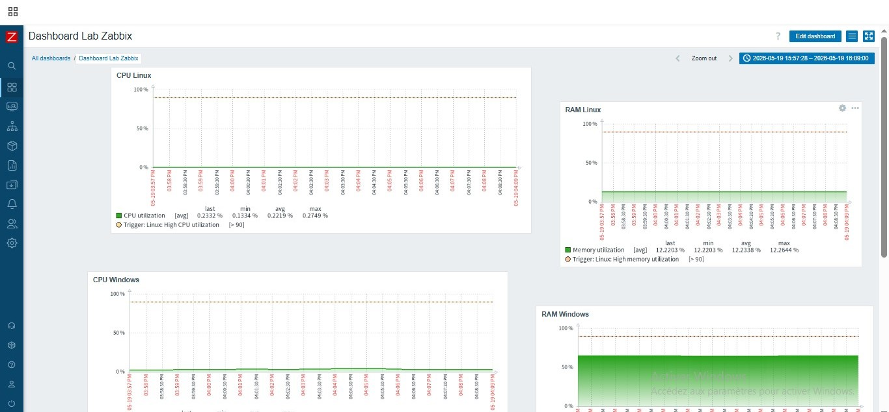
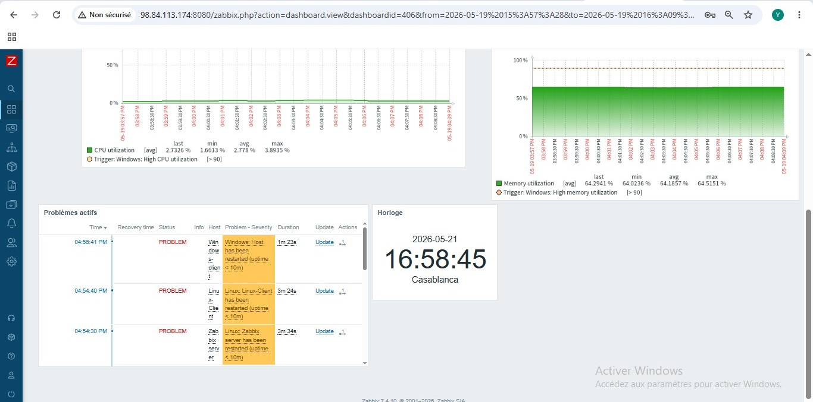
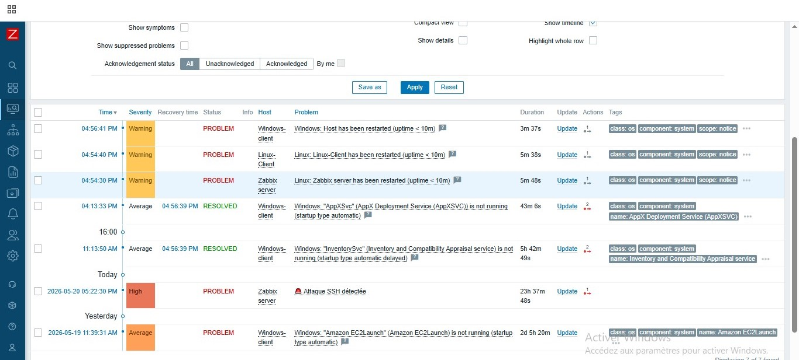
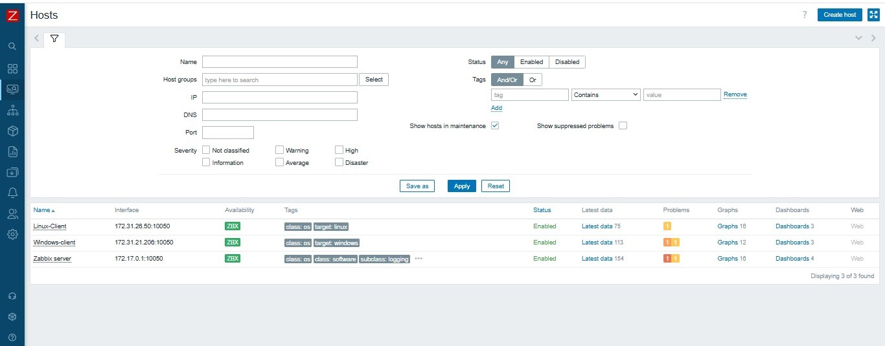
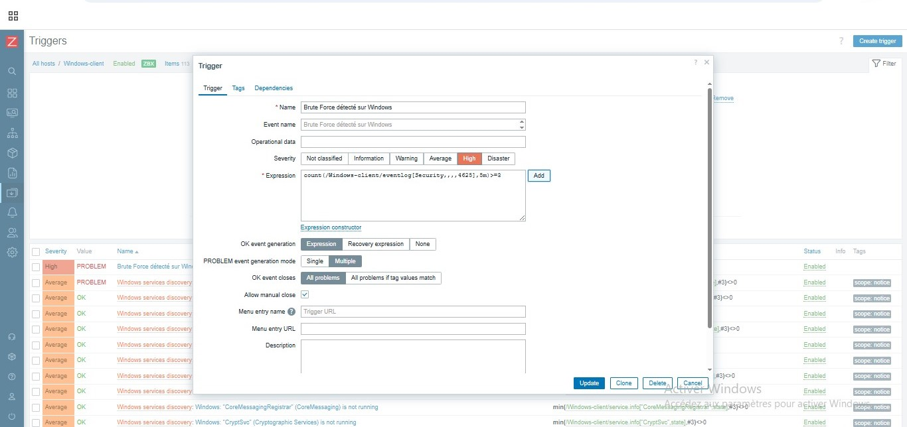

# 🛡️ Zabbix Monitoring Lab — Détection d'attaques en temps réel


> Projet de monitoring réseau complet avec Zabbix 7.4, déployé sur AWS EC2 via Docker.
> Inclut la détection en temps réel d'attaques Brute Force SSH (Linux) et RDP (Windows)
> avec alertes automatiques.

---

## 📋 Description

Ce lab met en place une infrastructure de monitoring et de détection d'intrusion avec :

- **Zabbix Server 7.4** déployé via Docker Compose sur AWS EC2
- **3 machines monitorées** : Serveur Zabbix, Linux-Client, Windows-Client
- **Détection d'attaque Brute Force SSH** sur le serveur Linux via `fail2ban` + Zabbix
- **Détection d'attaque Brute Force RDP** sur Windows via Event ID 4625
- **Alertes en temps réel** avec sévérité High dans le dashboard
- **Notification Gmail** configurée via SMTP

---

## 🏗️ Architecture

```
┌─────────────────────────────────────────────────────┐
│              AWS EC2 — us-east-1                    │
│                                                     │
│  VM_SERVER_ZABBIX (172.31.16.197)                   │
│  ├── Zabbix Agent (host)     → port 10050           │
│  └── Docker (172.18.0.0/16)                         │
│      ├── zabbix-server  172.18.0.2 → port 10051     │
│      ├── zabbix-web     172.18.0.3 → port 8080      │
│      └── zabbix-db      172.18.0.4 → PostgreSQL     │
│                                                     │
│  VM_CLIENT_ZABBIX (172.31.26.50)                    │
│  └── Zabbix Agent Linux      → port 10050           │
│                                                     │
│  VM_CLIENT_WINDOWS (172.31.21.206)                  │
│  └── Zabbix Agent Windows    → port 10050           │
└─────────────────────────────────────────────────────┘

Scénario d'attaque :
Linux-Client (172.31.26.50) ──Hydra/SSH──▶ Zabbix Server
Linux-Client (172.31.26.50) ──Hydra/RDP──▶ Windows-Client
```

---

## 📸 Screenshots

### Dashboard principal — CPU & RAM en temps réel


### Alertes actives en temps réel


### Page Problems — Historique des alertes


### Hosts — ZBX vert sur les 3 machines


### Configuration du trigger Brute Force


### 🔴 Alerte Brute Force détectée — High


---

## ⚙️ Installation

### Prérequis

- AWS EC2 Ubuntu 24.04 (t3.medium)
- Docker + Docker Compose
- Zabbix Agent installé sur Linux et Windows
- Ports ouverts dans Security Group : `22`, `8080`, `10050`, `10051`

---

### Étape 1 — Déploiement Zabbix Server avec Docker

```bash
mkdir ~/zabbix && cd ~/zabbix
nano docker-compose.yml
docker compose up -d
docker ps
```

Le fichier `docker-compose.yml` est disponible dans ce repo avec les IPs fixes configurées.

---

### Étape 2 — Configuration Agent Linux (Zabbix Server)

```bash
sudo nano /etc/zabbix/zabbix_agentd.conf
```

```ini
Server=127.0.0.1,172.17.0.1,172.18.0.2
ServerActive=127.0.0.1
Hostname=Zabbix server
```

```bash
sudo systemctl restart zabbix-agent
```

> ⚠️ Le Zabbix Server tourne dans Docker avec l'IP `172.18.0.2`.
> Il faut autoriser cette IP dans la config de l'agent.

---

### Étape 3 — Dashboard Zabbix

```
Data collection → Hosts → Zabbix server → Interfaces
Changer : 127.0.0.1 → 172.17.0.1 (Gateway Docker)
Port : 10050
```

---

### Étape 4 — Configuration Agent Windows

Fichier : `C:\Program Files\Zabbix Agent\zabbix_agentd.conf`

```ini
LogFile=C:\Program Files\Zabbix Agent\zabbix_agentd.log
Server=172.31.16.197
ServerActive=172.31.16.197
Hostname=Windows-client
Include=C:\Program Files\Zabbix Agent\zabbix_agentd.d\
```

```powershell
Restart-Service "Zabbix Agent"
```

> ⚠️ Ouvrir le port `10051` dans le Security Group AWS pour que
> l'agent Windows puisse envoyer les checks actifs au serveur.

---

### Étape 5 — AWS Security Group (Inbound rules)

| Port | Protocole | Source | Description |
|------|-----------|--------|-------------|
| 22 | TCP | 0.0.0.0/0 | SSH |
| 8080 | TCP | 0.0.0.0/0 | Zabbix Web |
| 10050 | TCP | 0.0.0.0/0 | Zabbix Agent |
| 10051 | TCP | 0.0.0.0/0 | Zabbix Server (Active checks) |

---

## 🔴 Scénarios d'attaque

### Scénario 1 — Brute Force SSH sur Linux (Zabbix Server)

**Attaquant :** Linux-Client (`172.31.26.50`)
**Cible :** Zabbix Server (`172.31.16.197`)

```bash
# Depuis Linux-Client
hydra -l ubuntu -P ~/passwords.txt ssh://172.31.16.197 -V -f -t 4
```

**Détection Zabbix :**
```
Trigger : Attaque SSH détectée
Severity : High
Item    : SSH failed login attempts
```

---

### Scénario 2 — Brute Force RDP sur Windows

**Attaquant :** Linux-Client (`172.31.26.50`)
**Cible :** Windows-Client (`172.31.21.206`)

```bash
# Depuis Linux-Client
hydra -l Administrator -P ~/passwords.txt rdp://172.31.21.206 -V -f -t 1 -W 3
```

**Item Zabbix configuré :**
```
Name:     Windows Security Failed Logins
Type:     Zabbix agent (active)
Key:      eventlog[Security,,,,4625]
Interval: 30s
```

**Trigger Zabbix :**
```
Name:       Brute Force détecté sur Windows
Severity:   High
Expression: count(/Windows-client/eventlog[Security,,,,4625],5m)>=3
Mode:       Multiple
```

**Résultat :**
```
Monitoring → Problems
🔴 High — PROBLEM — Windows-client — Brute Force détecté sur Windows
```

---

## 📧 Configuration Alertes Gmail

### 1. Créer un mot de passe d'application Google

```
https://myaccount.google.com/apppasswords
```

### 2. Configurer le Media Type dans Zabbix

```
Alerts → Media types → Create media type

Name:                Gmail Zabbix
Type:                Email
SMTP server:         smtp.gmail.com
SMTP port:           587
Connection security: STARTTLS
Authentication:      Username and password
Username:            votre-email@gmail.com
Password:            (mot de passe application 16 caractères)
```

### 3. Ajouter à l'utilisateur Admin

```
Users → Users → Admin → Media → Add
Type:    Gmail Zabbix
Send to: votre-email@gmail.com
```

---

## ✅ Résultat Final

| Composant | Statut |
|-----------|--------|
| Zabbix Server Docker | ✅ Opérationnel |
| Zabbix Web Interface | ✅ Port 8080 |
| Agent Linux-Client | ✅ ZBX Vert |
| Agent Windows-Client | ✅ ZBX Vert |
| Agent Zabbix Server | ✅ ZBX Vert |
| Détection Brute Force SSH | ✅ Alerte High |
| Détection Brute Force RDP | ✅ Alerte High |
| Notification Gmail | ✅ Configuré |

---

## 🔧 Commandes utiles

```bash
# Vérifier les conteneurs Docker
docker ps

# Logs Zabbix Server
docker logs zabbix-zabbix-server-1 --tail 50

# Statut agent Linux
sudo systemctl status zabbix-agent
sudo tail -f /var/log/zabbix/zabbix_agentd.log

# Tester connexion depuis Docker
docker exec zabbix-zabbix-server-1 sh -c "nc -zv 172.17.0.1 10050"

# Redémarrer les conteneurs
cd ~/zabbix && docker compose down && docker compose up -d

# Vérifier IPs Docker
docker inspect zabbix-zabbix-server-1 | grep IPAddress
docker network inspect zabbix_zabbix_net
```

---

## 📁 Structure du projet

```
zabbix-monitoring-lab/
├── README.md
├── docker-compose.yml
├── zabbix_agentd.conf
├── zabbix/
│   └── docker-compose.yml
└── screenshots/
    ├── 01-dashboard-cpu-ram.jpg
    ├── 02-dashboard-problems.jpg
    ├── 03-problems-list.jpg
    ├── 04-hosts-zbx-green.jpg
    ├── 05-trigger-config.jpg
    └── 06-brute-force-alert.jpg
```

---

## 🧠 Problèmes rencontrés et solutions

| Problème | Cause | Solution |
|----------|-------|----------|
| ZBX rouge sur Zabbix server | Docker utilise IP `172.18.0.2` pas `127.0.0.1` | Ajouter `172.18.0.2` dans `Server=` de l'agent |
| Item eventlog "Not supported" | Mode passif incompatible | Changer en `Zabbix agent (active)` |
| Agent Windows ne contacte pas le serveur | Port 10051 bloqué AWS | Ouvrir port 10051 dans Security Group |
| IPs Docker changent au redémarrage | Pas d'IPs fixes | Fixer les IPs dans `docker-compose.yml` |

---

*Projet réalisé avec Zabbix 7.4.10 sur AWS EC2 Ubuntu 24.04 — Mai 2026*
